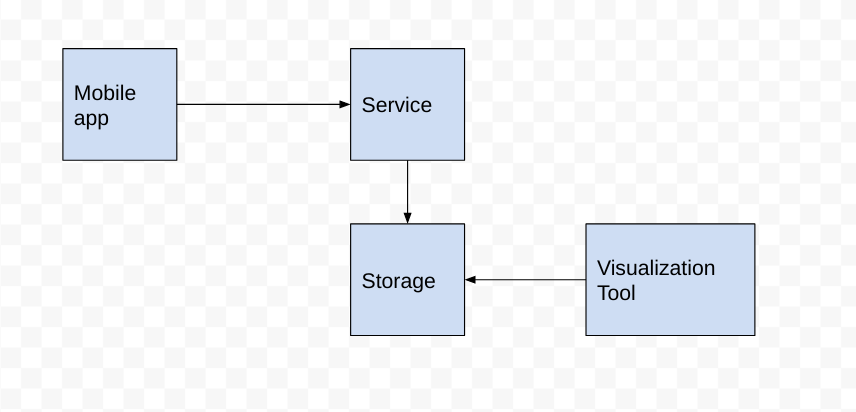

# Abstract

This document contains the proposal for gathering some default metrics of mobile apps and making them available to developers.

## Goals

### Goals

- Provide mobile app developers a service that can receive some basic default metrics, namely sdk version, app version and platform version

- Provide developers an interface to query and visualize the gathered data in order to make informed decisions

### Non Goals

- Identify individual devices or users in metrics events (bonus)

- Registering of user-defined metrics and logs (not prioritized; just kept in mind)

- Provide mobile app developers with an easy to use SDK to connect easily and securely to the metrics service (separate epic/proposal)

## Problem Description

As mobile apps are developed, improved and iterated on, different versions of those apps can be used on many different devices. 
Metrics data becomes invaluable for developers to observe the landscape of application installations and make sure further 
development and deployment of backend services will not affect users.

## Proposed Solution

A Metrics Service will be available from the Service Catalog, which can be provisioned by developers for use with their mobile applications.

The following diagram illustrates the components:




## Where it lives

Initially, we will extend the backend metrics APB and have the new components there. 

## Components

### Mobile App Client

Platform-specific SDK for targeting the metrics service will be available as IOS, Android and Cordova Plugins, React Native plugins.

Upon installation into a project and providing configuration for targeting the Metrics Service the SDK will automatically 
send the default metrics information for the application with a unique ID to the metrics service.
This information will be sent to the service every time the application starts.  

### Mobile Metrics Service

A thin HTTP-based service will be present to receive metrics data from the mobile applications and then to forward to the storage service.

At a PoC level, the endpoints available from the Mobile Metrics Service should be:

`POST /default-metrics`

Receives `Content-Type: application/json` containing JSON with following schema:
```
{
  "clientId": "453de743207a0232a339a23e5d64b289",
  "timestamp": "8377194421",
  "data": {
    "app": {
      "id": "com.example.someApp",
      "sdkVersion": "2.4.6",
      "appVersion": "256"
    },
    "device": {
      "platform": "android",
      "platformVersion": "27"
    }
  }
}
```

`timestamp` must be in UTC, without any time zone. Daylight saving should also be discarded. Server side application will get the timestamp and convert it to timestamp with server's timezone.
`timestamp` is the time when the event was recorded. Server side will also record the time when the payload was received and initially that will be used for the visualizations.


It is not part of this proposal what `device.id` is, but it must be something unique per device/client.

### Storage

Postgres will be the storage solution. It will have TimescaleDB installed in it, which provides time series database capabilities to Postgres.

As we will have both time series data and regular data, we need a storage system that provides both.

### Visualisation

The visualization service will be supplied by Grafana, which can utilize the storage service implementation directly as a data source.

As shared with the backend metrics service, Grafana's service will be behind OpenShift's [OAuth Proxy](https://github.com/openshift/oauth-proxy) 
that will pick up the permissions of the user's OpenShift cluster credentials.

### Authentication

Authentication of the service is not part of this proposal.

# Technical details

## Alternative architectures

We have investigated a number of alternative architectures. They're not going to be discussed here in detail. 

See <https://issues.jboss.org/browse/AEROGEAR-1894> for that. 

## Time series data vs non-time series data and 

Before starting the discussion, here is a good summary of what time series data and regular data means:

| Time series data                                          | Regular data                           |
|-----------------------------------------------------------|----------------------------------------|
| You normally do inserts                                   | You do inserts, but updates more often |
| Getting some stats about what happened in the last N days | Knowledge base                         |

Typically, what is tried to achieve here is done with inserting time series data in a time series database.
This answers the question "what's the number of SDK init events for SDK version 1.2.3 in last N days?"

However, in order to answer the question "what's the usage of SDK version 1.2.3 among clients?" we need to eliminate the duplicate events per client.
This is a knowledge base and not a stream of events.

Trying to build a knowledge base from a stream of events is not natural thing to do on a time series database. Aggregations would be super-complex 
(if even possible) and slow (due to very long time range and too many matching documents).

See <https://stackoverflow.com/questions/48378449/> for more information about this.

## Storage

The Storage service will store metrics data forwarded from the Mobile Metrics Service.

The requirements and preferences for the selected implementation are as follows:

- Support for inserts and updates
- Be able to become a data source for Grafana in order to avoid a separate visualisation layer
- Low enough resource usage in order to run in low-powered "evaluation" OpenShift clusters.
- Flexibility in metrics types for future-proofing

This leads us to Postgres as the storage. TimescaleDB is installed in Postgres as an extension to provide time series database capabilities.

Other options:
- ElasticSearch: high memory usage
- InfluxDB: time series data only
- MongoDB: no support on Grafana, poor time series support


In order to provide flexibility, we are going to use semi-structured tables in Postgres with JSONB columns for time series data.
For the data that we need to maintain, we will use regular SQL tables.

## Grafana vs others

User interface familiarity is an important factor for developers that use the overall metrics service, so addition of other visualisation 
tools like Kibana that would increase the learning curve of the solution should be avoided.

We choose Grafana as we already use it in other places.


## Postgres+Grafana vs ElasticSearch+Kibana

One of the POCs done for this proposal was about using ElasticSearch and Kibana. While we can satisfy the requirements of this epic with those, we avoided them because
 ElasticSearch requires much more memory.
