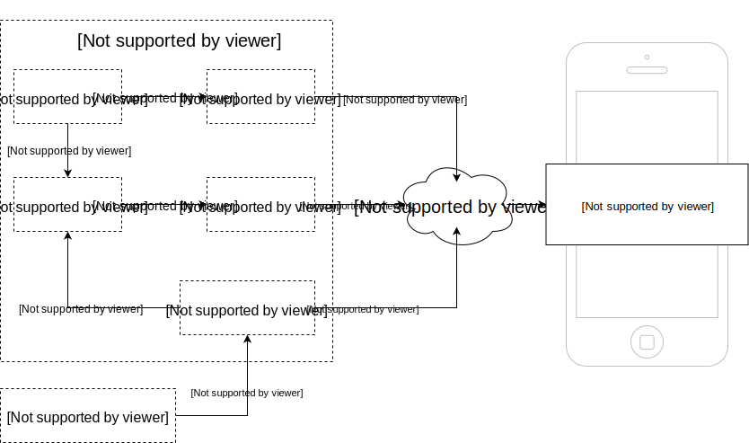

# Abstract

This document outlines what is needed to provide a set of the SDK's that can be used for JavaScript platforms, specifically Cordova, React Native & Web.

## Goals

### Primary Goals

* Provide SDKs (Core, Metrics, Auth etc..) for Mobile Developers to allow them to integrate Cordova & Web applications into Mobile Services.

### Secondary Goals

* Reuse as much JavaScript as possible between the different target platforms
* Provide modules that are compatible with React Native applications
* Provide mechanisms for feature-parity with a similar API between all target platforms considering their differences

## Problem Description

The 3 target platforms (Cordova, React Native & Web) all support JavaScript as the development language. To develop Mobile Apps that integrate into Mobile Services, it is necessary to provide SDKs for Mobile Developers for the target platform & language. These SDKs need to be written & maintained. 

## Proposed solution

Provide JavaScript implementations (via a JavaScript SDK). This means the default way of implementing an SDK interface will be in JavaScript. However, this may not always be possible. 
For the Cordova and React Native platforms we will provide a plugin that encapsulates the native code. This plugin conforms to an interface defined in the JS SDK that abstracts all the native platform specific code. Doing this will make Cordova, Web and React Native SDK's more consistent. We will bundle an
implementation of that Interface for the Web Platform in the JS SDK. The plugins for Cordova and React Native will be separate repositories. The JS SDK requires the users to install the plugin for those Platforms and it will utilize it to auto-detect the current platform at runtime.

### Advantages

- Ability to reuse code for Cordova, React Native & Web and work in a single repository
- Can reuse JavaScript implementations for keycloak, push, sync.js etc.
- No need to adjust native code (from Native SDKs) for plugin use. The native wrappers will not depend on the Android or iOS SDKs but provide their own implementations.

## Architecture

### Config parsing 

Despite the built-in `JSON` API to parse the configuration file, the Core SDK will contain a dedicated module to parse the configuration file, this has the following benefits:

- Better documentation of the configuration values via TypeScript interfaces
- Encapsulation of changes in the config file structure
- Possible support for dynamic and asynchronous fetching of future configuration values

### Metrics

As with the other SDKs, Core will contain the implementation for metrics gathering and reporting, providing a JS interface for uploading records which must also be used even by modules that rely heavily on native implementations, such as some of the Self-Defence Security Checks.

The uploading of metrics records utilizes the networking layer provided by Core.

### Individual SDKs

Depending on the SDK, a TypeScript/JavaScript implementation may be possible. In cases where it isn't, existing plugins can be used, or new plugins can be created for services.

## Adding a module to the JS SDK

New modules written JavaScript or Typescript will have the following items:

- A single `index` entry file that organizes and exposes all the exported contents of the module.
- Manually written or compiled files for a Cordova plugin should be present in the `www/` folder by convention
- Native code in the specific platform folder. i.e. `android/`, `ios/`
- A Cordova `plugin.xml` that references the code contents above via `<js-module>` and `<platform>` tags

### Adding native bindings to a plugin for Cordova

Native bindings can be required for some specific features of a 'main' JavaScript module.
These should be exposed as a separate NPM-installable plugin that expose the required features by the 'main' module.

The main module then feature-checks for the existance of the native feature and deal accordingly, allowing for a single codebase to adapt to different
execution environments and for graceful degradation.

The following diagram shows the relationship between native plugins, JavaScript code and client App code:



#### `plugin.xml` example

```xml
<platform name="android">
  <config-file target="res/xml/config.xml" parent="/*">
      <feature name="PlatformVersionModule" >
          <param
              name="android-package"
              value="org.aerogear.mobile.core.PlatformVersionModule"
          />
      </feature>
  </config-file>

  <js-module>
    <clobbers target="aerogear.platformVersion">
  </js-module>

  <config-file target="AndroidManifest.xml" parent="/*">
      <uses-permission android:name="android.permission.INTERNET" />
  </config-file>

  <source-file
      src="src/android/PlatformVersionModule.java"
      target-dir="src/org/aerogear/mobile/core/PlatformVersionModule"
  />
</platform>
```

#### Native plugin usage example

```javascript
// check for plugin presence
if (aerogear.platformVersion) {
    // utilize feature
    const version = ;
    aerogear.platforVersion.get()
        .then(version => metricsService.sendAppMetrics({
            //...
            platforVersion: version
        }));
} else {
    // take appropriate measures
}
```

### Adding native bindings to a plugin for React Native

Native bindings for React Native should also be delivered as a separate NPM package and register their native modules in react-native's `NativeModules` object.
The code in the 'main' JavaScript module should be able to check for the module's presence in order to react accordingly.

Optionally these can include typing declarations or convenience JavaScript to facilitate access, but these should still allow for feature-checking by the main module.


